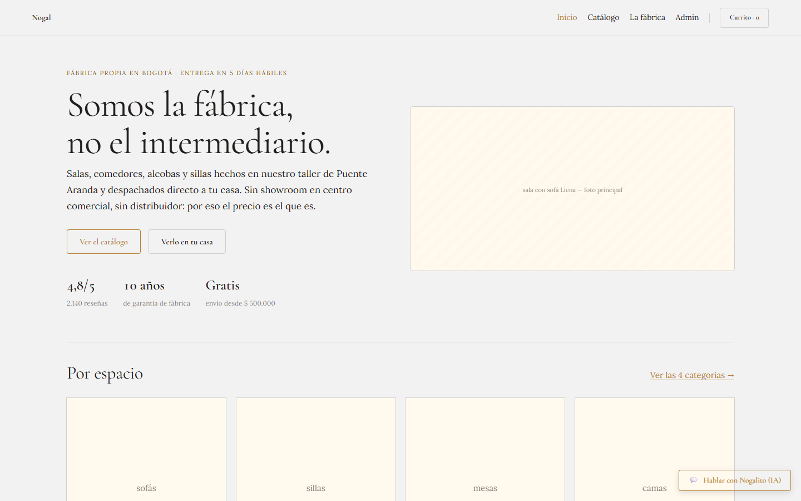
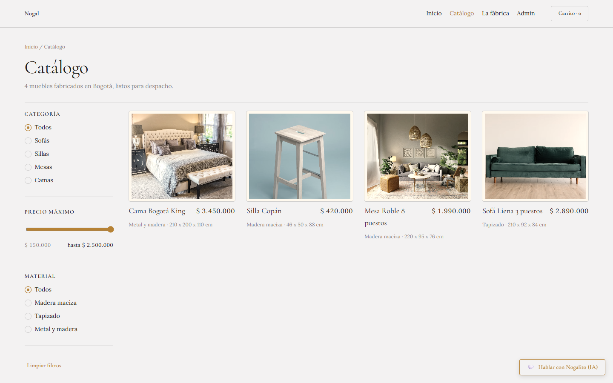
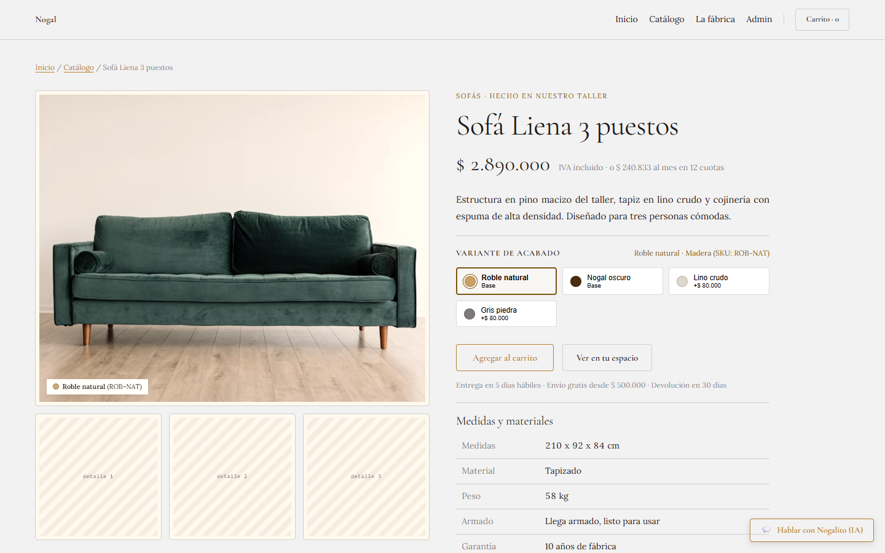
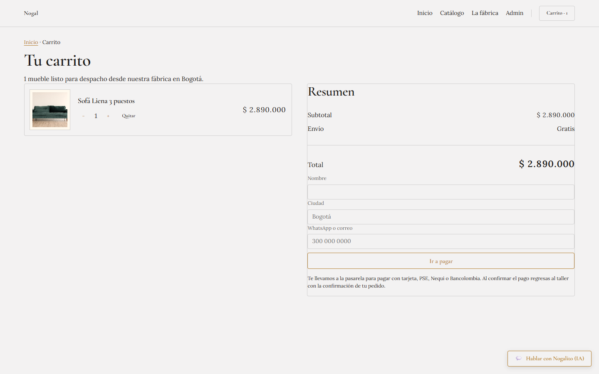
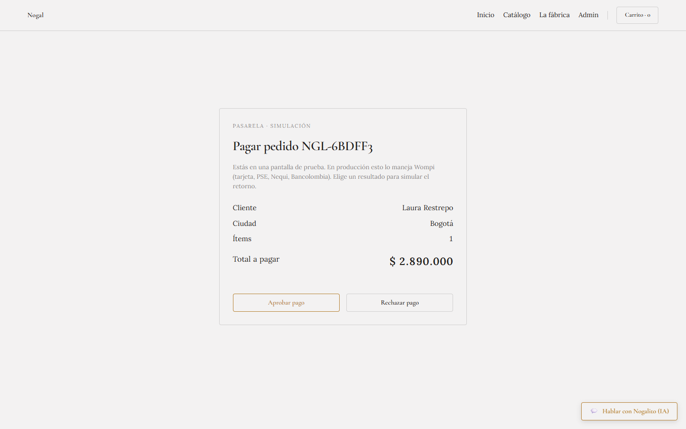
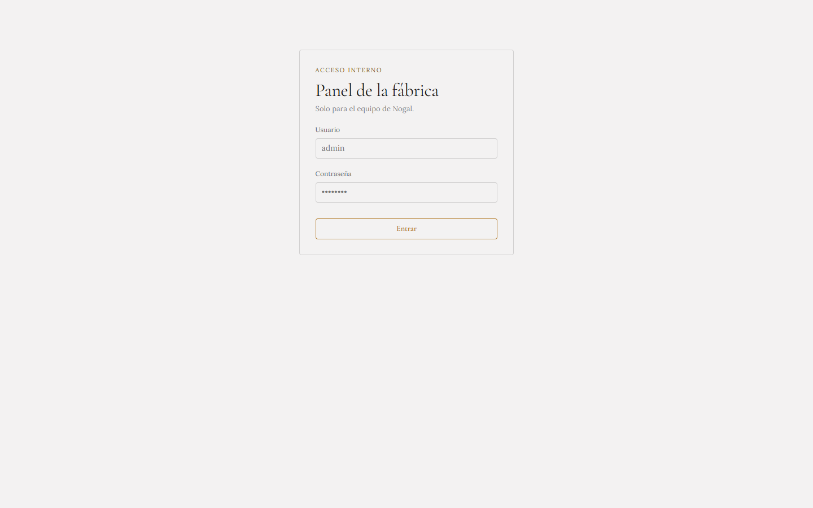
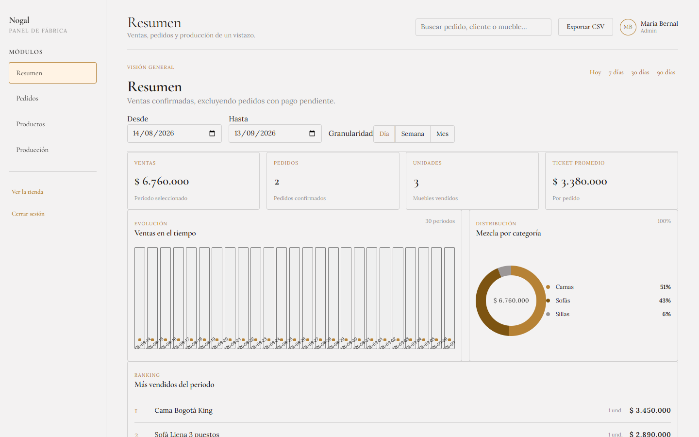
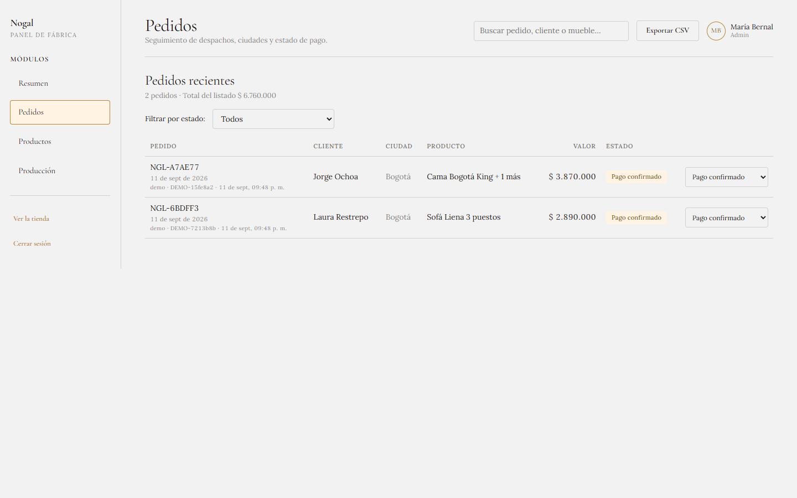
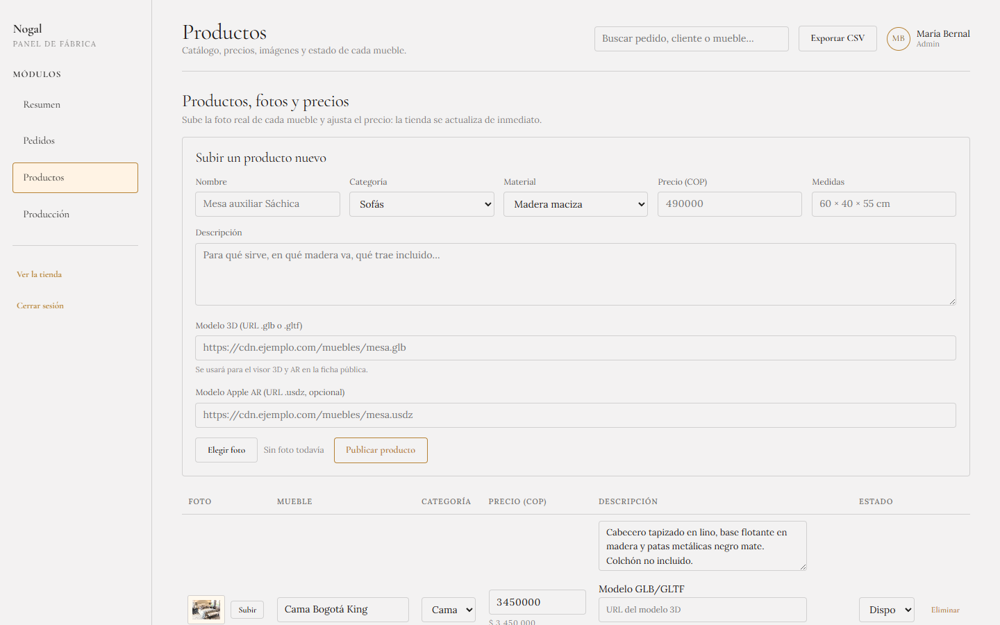

<p align="right"><a href="README.md">🇪🇸 Leer en español</a></p>

# Nogal — furniture store + factory admin panel

A production system for a furniture factory in **Puente Aranda, Bogotá (Colombia)** that sells direct to consumer. It ships two products on the same domain:

- **Public storefront** — home, catalog with filters, product page with a built-in AR 3D viewer, cart, checkout through the Wompi payment gateway, and a "Nogalito" chat widget.
- **Internal admin panel** — login, sales dashboard with date-range charts, product CRUD, order management, production stages and inventory.

Currency **COP** (`$ 1.890.000`, es-CO). UI language: Colombian Spanish.

> Production system for a family-owned business. This repository is public as a portfolio artifact — please review the [license](#license) before reusing any part of it.

---

## Preview

<p align="center">
  <br>
  <sub>Public home — "We are the factory, not the middleman".</sub>
</p>

<table>
  <tr>
    <td><br><sub>Catalog with category, material and price filters.</sub></td>
    <td><br><sub>Product page with AR 3D viewer (<code>@google/model-viewer</code>).</sub></td>
  </tr>
  <tr>
    <td><br><sub>Cart with finish variants.</sub></td>
    <td><br><sub>Wompi gateway in demo mode.</sub></td>
  </tr>
  <tr>
    <td><br><sub>Admin panel login.</sub></td>
    <td><br><sub>Dashboard with date range, KPIs and category mix.</sub></td>
  </tr>
  <tr>
    <td><br><sub>Orders, with state machine and status transitions.</sub></td>
    <td><br><sub>Products: image upload, inline editing, 3D URLs.</sub></td>
  </tr>
</table>

---

## Stack

**Backend**
- ASP.NET Core **.NET 9** Web API
- Entity Framework Core 9 + **PostgreSQL 16**
- JWT signed with BCrypt, delivered as an **`HttpOnly` cookie** (no token in `localStorage`)
- Swagger / OpenAPI
- Background queue for 3D generation (`IHostedService`)

**Frontend**
- **React 18 + TypeScript** with Vite
- React Router 6
- `@google/model-viewer` for AR (WebXR, Scene Viewer, Quick Look)
- Plain CSS with a custom token system ("Classical", in `styles.css`)

**Infra**
- `docker compose` — Postgres + API + Nginx serving the Vite build
- **GitHub Actions**: .NET build, Vite typecheck + build, Docker image builds with cache

---

## Implemented modules

| Module | Status | Notes |
|---|---|---|
| Catalog with filters (category, material, price) | Done | `GET /api/products` with pagination |
| Product page + finish variants | Done | Price and stock per variant |
| Cart and checkout | Done | Server-side session state |
| **Wompi payment gateway (demo mode wired end-to-end)** | Done | `IPaymentService` with a Demo/Wompi dispatcher |
| Per-product AR 3D viewer | Done | GLB/GLTF + USDZ, official `model-viewer` |
| Image-to-3D generation (queued) | Scaffold | Meshy adapter in place, real credentials pending |
| Admin — Dashboard | Done | Date range, day/week/month granularity, category mix, top 5 |
| Admin — Orders | Done | Status transitions, payment lifecycle closed |
| Admin — Products (CRUD) | Done | Multipart image upload, binary signature validation |
| Admin — Production and inventory | Done | Stages, capacity, materials to restock |
| Real home, contact form, "Nogalito" chat | Done | Persistence and history in DB |
| JWT auth in `HttpOnly` cookie | Done | `Admin` role for admin endpoints |

Roadmap and business context in [`prompt-continuar-funcionalidades.md`](prompt-continuar-funcionalidades.md).

---

## Architecture

```text
React + TypeScript + Vite   ──►   Controllers (HTTP, DTOs, [Authorize])
                                       │
                                       ▼
                                    IService  (contract)
                                       │
                                       ▼
                                    Services  (business rules, validation, mapping)
                                       │
                                       ▼
                                    EF Core / AppDbContext
                                       │
                                       ▼
                                    PostgreSQL 16
```

- No Repository Pattern: EF Core is consumed directly from `Services`.
- DTOs keep EF entities out of the public API surface.
- Business validations (name, price, category, material, state machines) live in `Services`; `Controllers` only translate errors to `400`.
- Migrations run automatically at startup via `Database.MigrateAsync()`.
- Dates: the domain is interpreted in **Bogotá calendar** and converted to UTC before hitting Postgres.

Full screen-by-screen spec, tokens and contracts in [`design_handoff_nogal/README.md`](design_handoff_nogal/README.md).

---

## Run locally

### Option A — Docker (recommended)

```powershell
copy .env.example .env
# edit .env: change JWT_KEY and POSTGRES_PASSWORD

docker compose up --build
```

- Store:    http://localhost
- API:      http://localhost:5199 (Swagger at `/swagger` in Development)
- Postgres: `localhost:5432` (user `nogal`)

Image uploads and 3D models persist in the `nogal_api_uploads` volume.

### Option B — No Docker (dev with hot reload)

Requirements: **.NET 9 SDK**, **Node 20+**, **Postgres 16** running locally (or the container above running alone).

```powershell
# Backend
cd design_handoff_nogal\backend\NogalApi
dotnet restore
dotnet run
# API at http://localhost:5199

# Frontend (separate terminal)
cd design_handoff_nogal\frontend\nogal-web
npm install
npm run dev
# Vite at http://localhost:5173, proxying to :5199
```

Initial admin credentials are seeded from `AdminSeed` in `appsettings.json`. Change them for any real deployment.

---

## Verification

```powershell
# Backend
cd design_handoff_nogal\backend\NogalApi
dotnet build .\NogalApi.sln

# Frontend
cd design_handoff_nogal\frontend\nogal-web
npm run build
```

CI runs the same on every push to `main` and every PR (`.github/workflows/ci.yml`).

---

## Structure

```
definitivo/
├── design_handoff_nogal/
│   ├── backend/NogalApi/       # ASP.NET Core 9 + EF Core + Postgres
│   ├── frontend/nogal-web/     # React 18 + Vite + TypeScript
│   ├── Nogal Muebles.dc.html   # Design prototype (visual source of truth)
│   ├── styles.css              # "Classical" system (tokens + components)
│   ├── sistema-classical.md    # Written design system guide
│   └── README.md               # Screen-by-screen functional spec
├── docker-compose.yml
├── .env.example
├── .github/workflows/ci.yml
└── README.md                   # (Spanish entry point)
```

---

## Notable technical decisions

- **`HttpOnly` cookie over `localStorage`** for the JWT: mitigates XSS at the cost of requiring CORS with `AllowCredentials()`. The backend accepts the token via cookie *or* `Authorization` header (Swagger still works).
- **No Repository Pattern**: adding another layer on top of EF Core, which is already a data abstraction, would be over-engineering for this domain.
- **Wompi via `IPaymentService` dispatcher**: the demo implementation lets orders complete end-to-end without real credentials; switching to production Wompi is a flag and a key away.
- **3D models stored as URLs, not blobs**: the API only stores `Modelo3dUrl` / `ModeloUsdzUrl`; the files live wherever it makes sense (bucket, CDN). Queue and state machine are ready to plug a real image-to-3D provider (Meshy scaffolded).
- **Dates in Bogotá calendar**: dashboard ranges are interpreted as local business days and only converted to UTC at query time. Avoids reports that "shift by one day".

---

## License

**Copyright © 2026 Anderson Suarez. All rights reserved.**

This repository is **public as a portfolio artifact** and as the running deployment of a family-owned furniture factory's operations system. **It is not open source software.**

- You may **read, study, and share the link**.
- You may **not** copy, redistribute, publish, sublicense, or use this code — in whole or in part — in your own or third-party products, commercial or otherwise, without prior written permission.
- Short evaluative excerpts (a single function as a technical reference, with attribution) are permitted under reasonable fair use. Cloning the project to launch a similar store is not.

See the [`LICENSE`](LICENSE) file for the full text.

If you want to use this for your own business or license it commercially: reach out.

---

## Author

**Anderson Suarez** · titusandersonsuarez@gmail.com
