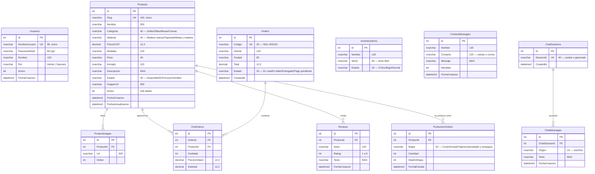

# Prompt para IA — Continuar funcionalidades de Nogal

Pega este bloque completo en la IA con la que vayas a seguir trabajando (Claude Code u otra). Da contexto del estado actual del proyecto y de qué sigue.

---

## PROMPT

Eres un ingeniero de software full-stack senior. Vas a continuar el desarrollo de **Nogal**, el sistema de venta de muebles de una fábrica en Bogotá (Puente Aranda), sobre un proyecto que **ya tiene código de arranque** — no partas de cero, extiende lo que existe.

### Estado actual del proyecto

- `design_handoff_nogal/` — paquete de diseño (fuente de verdad visual): `Nogal Muebles.dc.html` (prototipo completo, tienda + panel), `styles.css` (tokens y componentes del sistema "Classical"), `sistema-classical.md` (guía de uso) y `README.md` (spec funcional completa de cada pantalla).
- `backend/NogalApi/` — API en ASP.NET Core 9 + EF Core + SQL Server Express (`.\SQLEXPRESS`, base `NogalDb`). Ya implementado: modelos de usuarios, productos, pedidos, ventas, producción, inventario y comunicación; servicios por interfaz; JWT con BCrypt; seed automático; CORS; Swagger; almacenamiento local de imágenes; cola de generación 3D; `Dockerfile`.
- `frontend/nogal-web/` — React 18 + TypeScript + Vite. Ya implementado: tienda pública, catálogo, ficha, home, contacto, chat, login, panel, productos, pedidos, dashboard, producción, inventario y visor AR con `@google/model-viewer`.
- El `docker-compose.yml` histórico de Postgres no se usa: el backend actual se conecta a SQL Server Express mediante `Trusted_Connection=True` y `TrustServerCertificate=True`.

Antes de escribir código, **lee `design_handoff_nogal/README.md` completo** (ahí está la especificación pantalla por pantalla, el modelo de datos sugerido y los endpoints mínimos) y **revisa el HTML del prototipo** para copiar la disposición y las clases exactas (`.card`, `.table`, `.tag`, `.seg`, `.dialog`, etc.) — no inventes markup nuevo.

### Reglas que no se negocian

1. **Sigue el patrón de capas que ya existe** en `NogalApi` (Models → Data/DbContext → Services (interfaz + implementación) → Controllers) para cada entidad nueva. No mezcles lógica de negocio en los controllers.
2. **Todo estilo sale de `styles.css`** (colores, tipografía, espaciado, radios, sombras vía `var(--...)`) y de las clases ya definidas. Nunca un hex, un px o una fuente sueltos.
3. Moneda **COP**, formato `es-CO` (ej. `$ 1.890.000`). Idioma español colombiano en toda la UI y los mensajes de error.
4. Las imágenes de producto se guardan como **URL** (bucket S3/GCS), nunca como binario en la base de datos.
5. Cada módulo nuevo necesita: migración de EF Core, endpoints REST, y la pantalla React conectada de verdad a la API (no mocks una vez que el backend exista).

### Estado del roadmap

1. **Productos, catálogo y ficha** — cerrado.
2. **Pedidos** — cerrado.
3. **Resumen/dashboard** — cerrado y conectado a SQL Server real.
4. **Producción e inventario** — cerrado y conectado a endpoints reales.
5. **Home, contacto y chat Nogalito** — cerrado con persistencia e historial.
6. **AR 3D por producto** — visor GLB/USDZ y URLs editables cerrados.
7. **Generación automática 3D** — cola, estados, migraciones y endpoint cerrados; falta únicamente elegir/configurar el proveedor image-to-3D y su adaptador real.

### Próximo trabajo recomendado

No rehacer módulos existentes. Candidatos (elige uno y ciérralo punta a punta):

1. **Webhook Wompi + HTTPS**: expone `POST /api/webhooks/wompi` con validación de firma `EventsSecret` para consistencia asíncrona (el cliente puede cerrar el navegador sin volver). Luego levantar el frontend en HTTPS público para poder activar `pub_prod_`.
2. **Almacenamiento de objetos (Azure Blob / S3)**: hoy imágenes y `.glb` viven en `wwwroot/uploads/`. Cambiar `IProductImageStorage` a una implementación cloud, mantener la interfaz.
3. **Cookie httpOnly para JWT**: hoy el token vive en `localStorage`. Migrar a cookie httpOnly con refresh + CSRF token para el panel.
4. **Reviews reales**: el modelo `Reviews` está en el Mermaid pero no implementado. Endpoint público de lectura, admin para moderación.
5. **Adaptador image-to-3D real**: Meshy ya tiene service scaffolded (`MeshyProduct3dGenerationService`), falta credencial + probar contra sandbox real.

Trabaja un módulo a la vez, de punta a punta (migración → endpoint → pantalla), y no avances al siguiente hasta que el anterior compile y funcione contra la base de datos real. Si necesitas decidir algo de negocio que el README no defina (zonas de envío, métodos de pago, textos de marketing), pregúntame en vez de inventarlo.

---

*Generado a partir del handoff de diseño `design_handoff_nogal/README.md` y del código ya scaffolded en `backend/NogalApi` y `frontend/nogal-web`.*

---

## ESTADO ACTUAL (última actualización: 2026-09-11, sesión de tarde)

> Esta sección se actualiza en cada sesión para que el próximo Claude (o tú) sepa exactamente qué corre, qué falta y en qué punto se dejó el trabajo. **No borrar; solo mantener al día.**

### Ubicación del proyecto

- Working directory raíz: `C:\Users\USUARIO\Desktop\definitivo\`
- Paquete Nogal (todo el código): `C:\Users\USUARIO\Desktop\definitivo\design_handoff_nogal\`

### Qué hace hoy el software

**Panel interno de la fábrica (implementado y funcional contra BD real):**

- **Login** con JWT (BCrypt para el hash, expiración 8h). Admin sembrado automáticamente al primer arranque: `admin` / `nogal2026`.
- **Shell del panel** con rail lateral (Resumen, Pedidos, Productos, Producción), topbar, `RequireAuth` que redirige a login si no hay sesión.
- **Productos (CRUD completo)**:
  - Formulario "Subir un producto nuevo" con nombre, categoría, material, precio (paso 10.000), medidas, descripción y foto opcional.
  - Tabla editable con miniatura, nombre, categoría, precio (formato COP en vivo), descripción, estado (Disponible / EnProceso / Vendido).
  - Guardar cambios explícito por fila (patrón borrador → Guardar), soft delete y restaurar desde chips de eliminados.
  - Subida de foto multipart con guardado en disco (`wwwroot/uploads/products/`) — la BD solo guarda la URL relativa.
  - Endpoint público con filtros (`categoria`, `material`, `precioMax`, paginación) conectado a la UI del catálogo.

**Módulos funcionales:** Productos, variantes de acabado, catálogo, ficha pública, pedidos, dashboard, producción, inventario, home pública real, contacto, chat "Nogalito", **carrito + checkout + pasarela de pago (Wompi demo/sandbox)**.

**AR 3D por producto:** implementado con `@google/model-viewer`; la ficha usa GLB/GLTF y USDZ opcional desde las URLs guardadas en cada producto.

**Generación automática 3D:** al subir la imagen del producto, la API guarda el producto y encola un trabajo en segundo plano. Se persisten los estados `Sin modelo`, `Pendiente`, `Procesando`, `Disponible` y `Error`; los trabajos pendientes se reencolan al reiniciar. El proveedor image-to-3D sigue desactivado por defecto porque requiere una API key y un adaptador real que devuelva las URLs GLB/USDZ. No crear archivos 3D falsos localmente.

### Qué falta (roadmap ordenado)

- [x] **0. Auth + scaffold del panel**
- [x] **1. Productos (CRUD admin + endpoint público)**
- [x] **2. Catálogo público + ficha de producto** — CERRADO el 2026-09-11.
  - `layouts/StoreLayout.tsx` — header sticky con nav (Inicio / Catálogo / La fábrica / Admin / Carrito · 0) que envuelve todas las rutas públicas.
  - `pages/store/CatalogoPage.tsx` — breadcrumb + h1 + conteo dinámico + aside con radios categoría, range precio (150k–2.5M step 50k), radios material, botón "Limpiar filtros". Grid `auto-fill minmax(200px, 1fr)` con tarjetas `.plate` 4:3.4. Estado vacío con CTA. Los filtros son estado controlado y llaman `GET /api/products` en cada cambio.
  - `pages/store/ProductoPage.tsx` — breadcrumb, dos columnas (galería `.plate` 4:3.2 + 3 miniaturas 1:1 / info kicker + h1 + precio 34px + descripción justificada). Segmentado de Acabado (Roble natural / Nogal oscuro / Lino crudo / Gris piedra) — solo UI local (la BD no tiene variantes de acabado por producto todavía). Tabla Medidas/Material/Peso/Armado/Garantía. Sección "Combina bien con" con 3 productos de otras categorías.
  - `pages/store/HomePlaceholder.tsx` — contiene la home pública implementada con hero, categorías, productos reales, AR informativo, reseñas, servicios, contacto, chat y footer.
  - `App.tsx` — rutas `/`, `/catalogo`, `/producto/:slug` envueltas por `<StoreLayout />`. `/admin/*` sigue igual con `AdminLayout` + `RequireAuth`.
  - `api/products.ts` — agregado `obtenerPorSlug(slug)`.
  - Verificación real: catálogo sin filtros, filtro por categoría, por material+precioMax, filtro imposible (estado vacío OK), ficha por slug, 404 en slug inexistente, frontend sirviendo HTML. 7/7 pasan.
- [x] **3. Pedidos** — CERRADO el 2026-09-11.
  - Backend: `Models/{Order,OrderItem}.cs`, `Models/Orders/{OrderCatalogo,OrderDtos}.cs`, `Services/{IOrderService,OrderService}.cs` con generador `NGL-XXXXXX` (hex 6 chars, único), `Controllers/AdminOrdersController.cs` (`GET /api/admin/orders?estado=&pagina=&tamano=`, `GET /{id}`, `PATCH /{id}/status`), `Data/OrderSeeder.cs` (5 pedidos demo al primer arranque si Products tiene al menos 1), migración `20260911170850_AddOrders`.
  - `OrderItem` tiene `NombreProducto` denormalizado — el pedido histórico mantiene el nombre del producto al momento de la compra aunque el producto cambie después. FK a Products con `RESTRICT` para no permitir eliminaciones físicas de productos con pedidos.
  - `CatalogController.Options()` ahora también expone `estadosPedido`.
  - Frontend: `types/order.ts`, `api/orders.ts`, `pages/admin/PedidosPage.tsx` reescrita completa — header con conteo + total del listado, filtro por estado, tabla con Pedido (código + fecha), Cliente, Ciudad, Producto (resumen), Valor derecha, Estado como `.tag` (clases mapeadas: En ruta/Pago pendiente = outline, En taller = accent, Entregado = neutral), select de cambio de estado inline por fila.
  - Verificación real: listar 5 sembrados, filtrar por Entregado (2), obtener por id con items, PATCH cambio de estado, validación 400 con estado inválido, 401 sin auth. 7/7 pasan.
- [x] **4. Resumen (dashboard)** — CERRADO el 2026-09-11.
  - Backend: `Models/Sales/SalesDtos.cs`, `Services/{ISalesService,SalesService,SalesQueryException}.cs`, `Controllers/AdminSalesController.cs`, registrado en `Program.cs`.
  - Endpoint protegido con rol `Admin`: `GET /api/admin/sales?from=yyyy-MM-dd&to=yyyy-MM-dd&granularity=day|week|month`.
  - Las fechas representan calendario de Bogotá, con `to` exclusivo y conversión a UTC. Los pedidos `Pago pendiente` se excluyen de ventas confirmadas.
  - Frontend: `types/sales.ts`, `api/sales.ts`, `pages/admin/ResumenPage.tsx` y estilos de dashboard en `styles.css`. Incluye rangos rápidos, filtros, cuatro KPI, barras seleccionables, mezcla por categoría y top 5.
  - Verificación real: `401` sin JWT, `400` con fecha inválida, `200` autenticado contra SQL Server con datos reales; `dotnet build` y `npm run build` pasan.
- [x] **AR 3D por mueble** — CERRADO el 2026-09-11.
  - Backend: `Product.Modelo3dUrl` y `Product.ModeloUsdzUrl`, incluidos en DTOs, mapeos de `ProductService` y migración `20260911183658_AddProduct3dModels`.
  - Frontend: `@google/model-viewer`, `components/ArDialog.tsx`, declaración JSX `model-viewer`, URLs editables en `pages/admin/ProductosPage.tsx` y visor conectado en `pages/store/ProductoPage.tsx`.
  - Android/WebXR usa el GLB/GLTF; iOS/iPadOS usa USDZ mediante Quick Look. Sin modelo se muestra un mensaje informativo.
  - Verificación: backend y frontend compilan; la migración contiene las dos columnas opcionales `nvarchar(500)`.
- [x] **Cola de generación 3D** — estructura implementada el 2026-09-11.
  - Backend: `Options/Product3dOptions.cs`, `Services/{IProduct3dGenerationService,UnavailableProduct3dGenerationService,Product3dGenerationQueue}.cs` y `POST /api/admin/products/{id}/3d-generation`.
  - Subir una imagen en `POST /api/admin/products/{id}/image` marca el producto como `Pendiente` y encola el trabajo automáticamente.
  - La migración `AddProduct3dGenerationStatus` añade estado, error y fecha de solicitud.
  - Próximo paso técnico: implementar el adaptador del proveedor elegido (Meshy, Tripo u otro) con sus credenciales en variables de entorno. Mientras tanto el estado termina en `Error` con un mensaje explícito de configuración faltante.
- [x] **5. Producción** — CERRADO el 2026-09-11.
  - Backend: `ProductionOrder`, `InventoryItem`, `ProductionService`, siembra inicial y migración `20260911181104_AddProductionAndInventory`.
  - Endpoints protegidos: `GET /api/admin/production` y `GET /api/admin/inventory`.
  - Frontend: `ProduccionPage` consume ambos endpoints y muestra las cuatro etapas, capacidad mensual y los materiales ordenados por prioridad.
- [x] **6. Home pública + contacto + chat "Nogalito"** — CERRADO el 2026-09-11.
  - Home con hero, categorías, productos reales, AR informativo, reseñas, servicios, contacto y footer.
  - `POST /api/contact` persiste los mensajes de contacto; `POST /api/chat` mantiene sesión e historial y responde por reglas para envíos, pagos, garantía, armado, taller, cambios y personalización.
  - Migración `20260911181956_AddCommunication` aplicada a SQL Server.
- [x] **7. Variantes de acabado por producto** — CERRADO el 2026-09-11.
  - Modelo `ProductVariant` con `ProductId`, `Sku`, `Nombre`, `Tipo` (Madera/Tela/…), `CodigoColorHex`, `PrecioAjusteCOP`, `FotoUrl`, `Stock`, `Activo`, `Orden`. Índice único `(ProductId, Sku)`, FK con `Cascade`.
  - `DbSeeder.SeedProductVariantsAsync` siembra 4 acabados por producto (Roble natural, Nogal oscuro, Lino crudo +$80k, Gris piedra +$80k) al primer arranque.
  - `ProductService` incluye variantes al mapear a DTO público. `ProductoPage.tsx` renderiza el segmentado real y actualiza el precio en vivo.
  - Migración `20260911202133_AddProductVariants`.
  - **Trampa resuelta**: la migración original `20260911190000_AddProductVariants` del commit `68ffafd` vino mal generada (Designer vacío + snapshot desactualizado). Se regeneró con `dotnet ef migrations remove` + `add`, quedando con timestamp `20260911202133`. Si vuelve a pasar, verificar el snapshot antes de intentar `database update`.
- [x] **8. Carrito + Checkout + Variantes en pedido** — CERRADO el 2026-09-11.
  - Backend: `Order.Contacto`, `Order.EnvioCOP`, `OrderItem.ProductVariantId/VarianteNombre/PrecioAjusteVariante` (denormalizados como `NombreProducto`). `OrderService.CrearAsync` recalcula precios y totales server-side, valida producto activo y variante asociada, aplica envío gratis desde $500.000 (si no, $30.000). `POST /api/orders` público (sin auth) crea el pedido en estado `Pago pendiente`. `GET /api/orders/{codigo}` público para consultar.
  - Frontend: `cart/CartContext.tsx` con `localStorage` (clave `nogal_carrito`), `layouts/StoreLayout.tsx` con contador reactivo, `ProductoPage.tsx` conectada al context (incluye variante seleccionada), `pages/store/CarritoPage.tsx` (lista + qty stepper + form cliente + resumen), `pages/store/GraciasPage.tsx` (confirmación con copy dinámico según estado).
  - Migración `20260911204927_AddOrderContactShippingAndVariants`.
  - Regla de negocio: **envío gratis desde $500.000; $30.000 debajo**. Coincide con lo que dice la home y el chat Nogalito.
- [x] **9. Home pública real (reemplaza `HomePlaceholder`)** — CERRADO el 2026-09-11.
  - `pages/store/HomePage.tsx` (nuevo, sustituye `HomePlaceholder.tsx`) con las 8 secciones del prototipo: hero (kicker + h1 + lead + 2 botones + 3 cifras), "Por espacio" (links a `/catalogo?categoria=X`), "Los más pedidos" (4 productos reales), banner AR (dispara `<ArDialog />`), "Lo que cuenta la gente" (3 testimonios), 4 servicios con copy completo, contacto (`POST /api/contact`) + info del taller (Cra. 56 #17-40, WhatsApp 300 000 0000), footer 4 columnas.
  - `pages/store/CatalogoPage.tsx` ahora lee y sincroniza `?categoria=X` en la URL para permitir enlaces desde la Home.
  - Estilos: usa las clases `.home-*` ya presentes en `styles.css` (no se agregó CSS nuevo).
- [x] **11. Cierre del loop admin de pagos** — CERRADO el 2026-09-11.
  - `OrderListItemDto` gana `PagoProveedor`, `PagoTransaccionId`, `PagoActualizadoEn` (mapeados en `OrderService.MapListItem`).
  - `pages/admin/PedidosPage.tsx` — el switch `tagClasePorEstado` cubre los 6 estados: `Pago confirmado` y `En taller` = accent (acción del equipo), `Entregado` = neutral (cerrado), `Pago pendiente`/`Pago rechazado`/`En ruta` = outline. Cada fila muestra una línea bajo el código con `proveedor · txnId · fecha del pago` cuando existe.
  - El filtro por estado ya funciona con los estados nuevos (los toma de `/api/catalog/options`).
  - Flujo admin verificado: filtrar `Pago confirmado` → ver pedidos listos para mandar a producción → cambiar estado a `En taller` con el select por fila.
- [x] **10. Pasarela de pago Wompi (demo + scaffold real)** — CERRADO el 2026-09-11.
  - Backend:
    - `Options/WompiOptions.cs` con `Provider: "demo" | "wompi"`, `PublicKey`, `IntegritySecret`, `EventsSecret`, `CheckoutBaseUrl`, `ApiBaseUrl` (sandbox), `RedirectBaseUrl`, `DemoCheckoutBaseUrl`.
    - `Services/IPaymentService.cs`, `DemoPaymentService`, `WompiPaymentService` (Redirection API con firma SHA256 `sha256(reference + amountInCents + currency + integritySecret)` + consulta de estado por `GET /transactions/{id}`), `PaymentServiceDispatcher` (fallback a demo si faltan credenciales).
    - `Order` gana `PagoProveedor`, `PagoTransaccionId`, `PagoActualizadoEn`. `OrderCatalogo` gana estados `PagoConfirmado`, `PagoRechazado`.
    - Endpoints públicos: `POST /api/orders/{codigo}/pago` (devuelve `checkoutUrl`), `POST /api/orders/{codigo}/pago/demo` (callback de la pantalla simulada), `POST /api/orders/{codigo}/pago/verificar?transactionId=X` (llamada al volver de Wompi real).
    - Helper estático `OrderService.GenerarCodigoUnicoAsync(context)` extraído para que el seeder no arrastre las dependencias del payment service.
    - Migración `20260911211111_AddOrderPaymentTracking`.
  - Frontend:
    - `pages/store/CarritoPage.tsx` — botón "Ir a pagar" que encadena `crear()` → `iniciarPago()` → `window.location.href = checkoutUrl`.
    - `pages/store/PagoDemoPage.tsx` (nuevo) — pantalla simulación con "Aprobar / Rechazar" cuando Provider = "demo".
    - `pages/store/GraciasPage.tsx` — lee `?id=` del callback de Wompi y llama `verificarPago`; título/copy/tag dinámicos según estado; botón "Reintentar el pago" si fue rechazado.
    - Ruta nueva: `/carrito/pago-demo/:codigo`.
  - Modo demo probado end-to-end (aprobar y rechazar). Modo Wompi real listo; requiere `PublicKey` + `IntegritySecret` y cambiar `Provider` a `"wompi"` en `appsettings.json`.
  - **Pendiente para producción**: endpoint `POST /api/webhooks/wompi` con validación de firma `EventsSecret` (para casos donde el cliente cierre el navegador sin volver) + HTTPS público (Wompi rechaza redirect a `http://` en prod).

### Diagrama de base de datos

Estado actual + planeado. Se puede ver renderizado en cualquier vista Markdown con soporte Mermaid (VS Code, GitHub, Obsidian).



**Alternativa en texto** (por si no tenés Mermaid a mano):

```
IMPLEMENTADAS (migraciones aplicadas 2026-09-11)
  Usuarios ─────────────────────────── login del panel (JWT)
                                        └ NombreUsuario UQ, PasswordHash BCrypt

  Products ─────────────────────────── catálogo real
    │                                   └ Slug UQ, Estado, Activo (soft delete)
    └── 1:N ── ProductImages ────────── galería + imagen principal
                                        └ Url, Orden, CASCADE DELETE

IMPLEMENTADAS (migraciones aplicadas 2026-09-11)
  Orders ───────────────────────────── panel de pedidos
    │                                   └ Estado: En ruta/En taller/Entregado/Pago pendiente
    └── 1:N ── OrderItems ──────────── FK → Products (RESTRICT recomendado)

  ProductionOrders ─────────────────── FK → Products (producción)
  InventoryItems ───────────────────── independiente (materiales por reponer)
  ContactMessages ──────────────────── formulario "Contáctanos"

  ChatSessions ─────────────────────── memoria del chat "Nogalito"
    └── 1:N ── ChatMessages ────────── historial user/bot por reglas

PENDIENTE
  Reviews ──────────────────────────── reseñas persistidas por producto
  Proveedor image-to-3D ────────────── adaptador externo y API key

  __EFMigrationsHistory ────────────── auto (EF Core, no tocar)
```

**Decisiones de esquema ya cerradas:**
- Enums como columnas `nvarchar` con validación en el service, NO como `int` con lookup table. Razón: la UI usa los mismos strings del prototipo (`Sofás`, `Madera maciza`) sin conversión, y agregar categorías nuevas es un `INSERT` conceptual, no una migración.
- Precios en `decimal(12,2)` (permite hasta $ 9.999.999.999,99 COP — suficiente).
- Soft delete via `Activo bit`. Nada de eliminación física, para conservar historial de pedidos que apunten a productos "eliminados".

### Cambio de motor de BD: Postgres → SQL Server

El prompt original y el README sugerían Postgres, pero el usuario ya tenía **SQL Server Express** corriendo local (`.\SQLEXPRESS`, puerto 1433) para `EntrevistaApi`. Reemplazamos el provider en esta sesión:

- `NogalApi.csproj`: `Npgsql.EntityFrameworkCore.PostgreSQL` → `Microsoft.EntityFrameworkCore.SqlServer 9.0.4`.
- `Program.cs`: `UseNpgsql` → `UseSqlServer`.
- `appsettings.json`: `Server=.\SQLEXPRESS;Database=NogalDb;Trusted_Connection=True;TrustServerCertificate=True;`.
- BD `NogalDb` creada por `MigrateAsync()` al arrancar.

Migraciones aplicadas:
- `20260911160600_InitialUsuarios` — tabla `Usuarios`.
- `20260911162006_AddProducts` — tablas `Products`, `ProductImages`, índice único en `Slug`, cascade delete.
- `20260911170850_AddOrders` — pedidos y líneas de pedido.
- `20260911181104_AddProductionAndInventory` — producción e inventario.
- `20260911181956_AddCommunication` — contacto y chat.
- `20260911183658_AddProduct3dModels` — URLs GLB/GLTF y USDZ.
- `20260911184410_AddProduct3dGenerationStatus` — estado, error y fecha de generación 3D.
- `20260911184558_NormalizeProduct3dState` — normaliza productos existentes a `Sin modelo`.
- `20260911202133_AddProductVariants` — tabla `ProductVariants` (regeneración del commit `68ffafd` que vino con Designer vacío).
- `20260911204927_AddOrderContactShippingAndVariants` — `Order.Contacto`, `Order.EnvioCOP`, columnas de variante en `OrderItem`, FK opcional a `ProductVariant` con `Restrict`.
- `20260911211111_AddOrderPaymentTracking` — `Order.PagoProveedor`, `Order.PagoTransaccionId`, `Order.PagoActualizadoEn`.

Docker Postgres del `docker-compose.yml` original **no se usa** (Docker Desktop apagado + puerto 5432 ya ocupado por Postgres locales del usuario). El compose queda como referencia histórica.

### Cómo arrancar

```powershell
# Backend en http://localhost:5199
cd design_handoff_nogal\backend\NogalApi
$env:ASPNETCORE_URLS = "http://localhost:5199"
dotnet run --no-launch-profile

# Frontend en http://localhost:5173 (en otra terminal)
cd design_handoff_nogal\frontend\nogal-web
npm run dev
```

Login del panel: `admin` / `nogal2026`. Swagger disponible en `http://localhost:5199/swagger`.

### Detalle de lo implementado (para ubicarse rápido en el código)

**Módulo 0 — Auth + scaffold**
- Backend: `Models/Usuario.cs`, `Models/Auth/{LoginRequest,LoginResponse}.cs`, `Data/{AppDbContext,DbSeeder}.cs`, `Options/{JwtOptions,AdminSeedOptions}.cs`, `Services/{IAuthService,AuthService}.cs`, `Controllers/AuthController.cs`.
- Frontend base: `api/{client,auth}.ts`, `auth/{AuthContext,RequireAuth}.tsx`, `layouts/AdminLayout.tsx`, `pages/admin/LoginPage.tsx`, `src/vite-env.d.ts` (fix `import.meta.env`). Las páginas del panel y la tienda se encuentran implementadas en sus módulos correspondientes.

**Módulo 1 — Productos**
- Backend: `Models/Product.cs`, `Models/ProductImage.cs`, `Models/Products/{ProductCatalogo,ProductDtos}.cs`, `Services/{IProductService,ProductService}.cs`, `Services/{IProductImageStorage,LocalProductImageStorage}.cs`, `Options/ImageStorageOptions.cs`, `Controllers/{AdminProductsController,ProductsController,CatalogController}.cs`, `wwwroot/uploads/products/`.
- Frontend: `types/product.ts`, `api/products.ts`, `pages/admin/ProductosPage.tsx` (reescrito completo), `api/client.ts` (agregado `apiUpload`).

**Módulo 4 — Resumen (dashboard)**
- Backend: `Models/Sales/SalesDtos.cs`, `Services/{ISalesService,SalesService,SalesQueryException}.cs`, `Controllers/AdminSalesController.cs`, registro en `Program.cs`.
- Frontend: `types/sales.ts`, `api/sales.ts`, `pages/admin/ResumenPage.tsx` y clases de dashboard en `styles.css`.
- Regla: solo se consideran ventas confirmadas los pedidos cuyo estado no es `Pago pendiente`.
- Fechas: `from` inclusivo y `to` exclusivo, interpretados en calendario de Bogotá y convertidos a UTC. La granularidad semanal comienza el lunes.

### Endpoints activos hoy

| Método | Ruta | Auth | Qué hace |
|---|---|---|---|
| POST | `/api/auth/login` | público | Devuelve JWT + datos del usuario |
| GET | `/api/auth/me` | Bearer | Datos del usuario autenticado |
| POST | `/api/auth/logout` | Bearer | No-op (JWT es sin estado — placeholder para blacklist futura) |
| GET | `/api/catalog/options` | público | Listas de categorías, materiales y estados |
| GET | `/api/products` | público | Listar con filtros `categoria`, `material`, `precioMax`, `pagina`, `tamano` |
| GET | `/api/products/{slug}` | público | Ficha por slug |
| GET | `/api/admin/products` | Bearer | Listar admin (incluye inactivos si `?incluirInactivos=true`) |
| GET | `/api/admin/products/{id}` | Bearer | Obtener por Id |
| POST | `/api/admin/products` | Bearer | Crear |
| PUT | `/api/admin/products/{id}` | Bearer | Actualizar |
| DELETE | `/api/admin/products/{id}` | Bearer | Soft delete (`Activo=false`) |
| POST | `/api/admin/products/{id}/restore` | Bearer | Restaurar |
| POST | `/api/admin/products/{id}/image` | Bearer (multipart) | Subir imagen (JPG/PNG/WEBP/GIF, máx 5 MB) |
| POST | `/api/admin/products/{id}/3d-generation` | Bearer, rol Admin | Encolar generación 3D; requiere imagen de referencia |
| GET | `/api/admin/sales?from=yyyy-MM-dd&to=yyyy-MM-dd&granularity=day\|week\|month` | Bearer, rol Admin | Dashboard: totales, buckets, categorías y top 5 |
| GET | `/api/admin/production` | Bearer, rol Admin | Etapas y capacidad de producción |
| GET | `/api/admin/inventory` | Bearer, rol Admin | Materiales e inventario |
| POST | `/api/contact` | público | Guardar mensaje de contacto |
| POST | `/api/chat` | público | Responder y persistir conversación de Nogalito |
| POST | `/api/orders` | público | Crear pedido desde el carrito (recalcula precios y envío server-side) |
| GET | `/api/orders/{codigo}` | público | Consultar pedido por código NGL-XXXXXX |
| POST | `/api/orders/{codigo}/pago` | público | Iniciar intención de pago; devuelve `checkoutUrl` de Wompi o pantalla demo |
| POST | `/api/orders/{codigo}/pago/demo` | público | Callback de la pantalla simulada (body `{aprobado:bool}`) — solo si Provider = "demo" |
| POST | `/api/orders/{codigo}/pago/verificar?transactionId=X` | público | Verificar el pago real contra Wompi al volver del checkout |
| GET | `/uploads/products/{archivo}` | público | Servido por `UseStaticFiles` |

### Decisiones tomadas en esta sesión

- **Motor BD**: SQL Server Express local en vez del Postgres del prompt (razón: el usuario ya lo tiene funcionando con `EntrevistaApi`).
- **Imágenes**: disco local (`wwwroot/uploads/products/`) con archivos nombrados por GUID. Interfaz `IProductImageStorage` para swapear a S3/GCS más adelante sin tocar el resto del código.
- **Categoría / Material / Estado**: listas fijas en `ProductCatalogo.cs` (backend) que el front consume vía `/api/catalog/options`. NO enums. NO tabla lookup.
- **Slug**: autogenerado del nombre (minúsculas + sin acentos + guiones), con sufijo `-2`, `-3`… en colisiones. Único en BD.
- **Soft delete**: `Product.Activo = false`. Público filtra por Activo; admin puede listar inactivos con `?incluirInactivos=true`.
- **Guardar en tabla del panel**: patrón borrador → botón "Guardar" explícito por fila (aparece cuando hay cambios). NO autosave onBlur.
- **Dashboard**: `SalesService` excluye `Pago pendiente`; no cambiar esta regla sin actualizar la documentación y las pruebas. `Pago rechazado` también debería excluirse cuando se sume esa fuente al SalesService (no hecho aún — la exclusión sigue siendo únicamente por `Pago pendiente`).
- **Generación 3D**: `Product3d:Enabled` está en `false` por defecto. La cola deja el producto en `Error` si no existe proveedor configurado; no crear GLB falsos.
- **Envío**: gratis desde $500.000; $30.000 debajo del umbral. La regla vive en `OrderService.CrearAsync` y se muestra en `CarritoPage`. Si se cambia el umbral, hay que actualizar también el texto de la home (`ENVIO_DESDE`) y el fallback del chat Nogalito.
- **Pasarela de pago**: `Wompi:Provider = "demo"` por defecto (mismo patrón que `Product3d.Provider`). El dispatcher hace fallback automático a demo si Provider = "wompi" pero faltan credenciales, con warning en logs. El precio de la transacción se recalcula server-side; nunca se confía en el amount que reporta el cliente.
- **Carrito**: persistido en `localStorage` bajo la clave `nogal_carrito`. Al confirmar pago exitoso se vacía. La clave de deduplicación de items es `productId::variantId` — el mismo producto con distinta variante son items separados.

### Convenciones vigentes (recordatorio)

- **Capas backend**: Models → DbContext → Services (I + impl registrada en DI) → Controllers. Nada de lógica de negocio en controllers.
- **Estilo**: solo tokens de `styles.css` — `var(--color-*)`, `var(--space-*)`, `var(--radius-*)`. Clases `.card`, `.table`, `.tag`, `.seg`, `.btn`, `.field`, `.input`, `.plate`, `.dialog`. Nada de hex/px/font-family sueltos. Énfasis con itálica, NO negrita.
- **Precios**: `Intl.NumberFormat('es-CO', { style: 'currency', currency: 'COP', maximumFractionDigits: 0 })`. Números con `font-variant-numeric: tabular-nums`.
- **Idioma**: español colombiano en toda la UI y mensajes de error.
- **Cerrar cada módulo punta a punta antes del siguiente**: migración → endpoint REST → pantalla React conectada real → verificación contra BD.
- **Prototipo HTML**: fuente de verdad visual. Copiar disposición y clases, no inventar markup nuevo.

### Trampas conocidas (para no perder tiempo)

- **PowerShell 5.1 + JSON con acentos**: `Invoke-RestMethod -Body $string -ContentType 'application/json'` con "Sáchica", "Sofás", etc. manda UTF-16 y la API devuelve 400. Solución:
  ```powershell
  $bytes = [System.Text.Encoding]::UTF8.GetBytes($json)
  Invoke-RestMethod -Uri $uri -Method Post -Body $bytes -ContentType 'application/json; charset=utf-8'
  ```
- **`dotnet ef` global es 8.0.27 pero runtime es 9.0.4**: funciona (avisa por consola). Actualizar con `dotnet tool update --global dotnet-ef` cuando puedas.
- **`app.UseHttpsRedirection()` con URLs solo HTTP**: emite warning "Failed to determine the https port" en cada arranque. No es crítico, se puede sacar en dev.
- **Migración generada después de un build**: si arrancás con `--no-build` inmediatamente después, el DLL viejo no incluye la migración nueva y `MigrateAsync()` no la encuentra. Solución: `dotnet build` primero.
- **Migración con `Designer.cs` vacío**: si alguien commitea una migración hecha a mano donde el `Designer.cs` no contiene el modelo completo y el `AppDbContextModelSnapshot.cs` no se actualizó, `dotnet ef database update` falla con `PendingModelChangesWarning`. Solución: borrar los dos archivos de la migración rota, restaurar el snapshot al estado de la migración anterior aplicada, y regenerar con `dotnet ef migrations add`. Pasó con `20260911190000_AddProductVariants` del commit `68ffafd`.
- **`dotnet ef migrations remove` no borra los archivos si el proceso .NET tiene el DLL abierto**: revierte el snapshot pero deja los archivos `.cs` de la migración removida. Cerrar el `dotnet run` en background antes de tocar migraciones.
- **Wompi requiere HTTPS público en producción**: sandbox acepta `http://localhost:5173`, pero al pasar a `pub_prod_` el `redirect-url` con `http://` es rechazado. Necesario levantar el frontend detrás de HTTPS (ngrok, Cloudflare Tunnel, o dominio real con cert) antes de activar prod.
